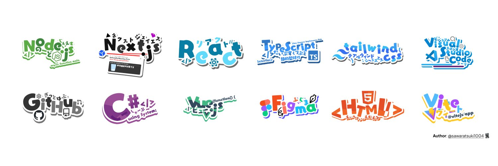

<!-- # Milton Ivan Garcia Lopez

I am a passionate programming professional with more than 3 years of experience in web application development. Throughout my career, I have maintained a constant commitment to quality and continuous improvement, which has generated a significant impact on my previous work by applying good programming practices.

[Website](https://ivangarcia.vercel.app/)

**Skills**

 -->

# 👋 Hello, I'm Milton Iván García López

🚀 Frontend Developer with **4 years of experience**, passionate about building **scalable** and **high-performance** web applications.
I specialize in **React** and **Next.js**, but I also love exploring new technologies.

---

## 🚀 Tech Stack & Skills

---

## 💼 Featured Projects

🚀 **[Color Rush](http://colorush.vercel.app/)** - Extract colors from any image in seconds.
📖 **[iBookmark](https://ibookmark.vercel.app/login)** - A modern bookmarking app for better organization.
🎮 **[Halo Insurrection](https://insurrectionce.vercel.app/)** - A fan-made Halo experience.
🎨 **[Latoons](https://latoons.vercel.app/)** - A fun and creative project for digital artists.
🖌 **[Pixel Kit](https://pixel-kit.vercel.app/)** - A tool for pixel-perfect design.

---

## 📫 Connect with Me

📌 **Twitter (X):** [@ivanglpz](https://x.com/ivanglpz)
📌 **LinkedIn:** [linkedin.com/in/ivanglpz](https://www.linkedin.com/in/ivanglpz/)
📌 **GitHub:** [github.com/ivanglpz](https://github.com/ivanglpz)
📌 **Portfolio:** [ivangarcia.vercel.app](https://ivangarcia.vercel.app/)

---

## 🎯 Current Learning Goals

🔥 Expanding my knowledge in **scalability, performance optimization**, and **new frameworks**.
📚 Exploring **advanced architectures** in **Next.js & Astro**.

---

## 📊 GitHub Stats

---

🌟 **Feel free to connect with me or check out my projects!** 🚀
